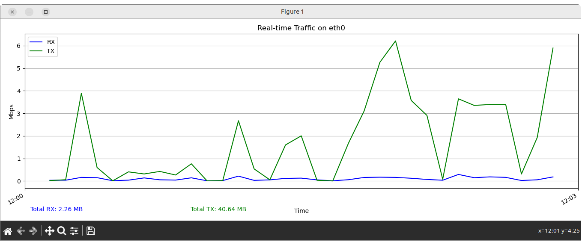

WiFi Modem Traffic Monitoring

This script was written to monitor Residential gateways (Routers, Modems, APs etc) that do not have support for SNMP for traffic statistics. This Python script provides a live traffic graph of the eth0 interface on a Tenda modem. The script uses Telnet to query the modem's interface statistics and displays the receive (RX) and transmit (TX) data rates in Mbps over time using matplotlib. It also shows cumulative data usage (in MB or GB) in real time.
Features:

    Monitors network traffic on the eth0 interface of a Tenda modem.

    Displays real-time RX and TX data rates in Mbps.

    Cumulative data usage is displayed in MB/GB.

    Plots the data on a live graph using matplotlib.

    Polls data every 5 seconds (configurable).

    Automatically handles reset in data counters.

Requirements:

    Python 3.x

    matplotlib

    telnetlib

    re

    time

    datetime

To install the required dependencies, use:

pip install matplotlib

Setup and Configuration:

    Configure the Modem Connection:

        Set the HOST, USERNAME, and PASSWORD variables to match your modem's details.
Modify Sampling Interval (Optional):

    The default interval for polling the modem is 5 seconds. You can adjust the INTERVAL variable as needed.

    INTERVAL = 10  # Poll every 10 seconds

How It Works:

    The script connects to the modem via Telnet.

    It logs in using the provided username and password.

    Every INTERVAL seconds, it queries the modem’s eth0 interface for the number of bytes received (RX bytes) and transmitted (TX bytes).

    The script computes the data rate in Mbps based on the difference between successive polls.

    A live graph is generated and updated with real-time data using matplotlib. The graph will show RX and TX rates as well as the cumulative traffic.

    After each poll, the graph is updated and old samples are trimmed to ensure the plot remains manageable.

Usage:

    Run the Script:

    python3 tenda_traffic_monitor.py

    View the Graph:

        A real-time graph will appear showing the RX and TX traffic over time.

        The graph updates every 5 seconds (or the interval you set).

    Stop the Monitoring:

        Close the window displaying the graph to stop the script.

Customization:

    Interface: The script assumes you're monitoring the eth0 interface. If you wish to monitor a different interface (e.g., wlan0), update the INTERFACE variable.

    INTERFACE = "wlan0"  # If you are using a wireless interface

    Max Samples: The number of samples in the graph is capped at 8640 to avoid memory issues with long-running sessions. You can adjust this by modifying the MAX_SAMPLES variable in the script.

    Plot Styling: You can customize the appearance of the plot, such as colors, labels, and gridlines, by modifying the matplotlib parameters in the update function.

Example Output:

The script will display a live graph with:

    X-Axis: Time (HH:MM format)

    Y-Axis: Data rate in Mbps (for both RX and TX)

    Graph Lines:

        Blue line for receive (RX) data

        Green line for transmit (TX) data

    Cumulative Data: Total RX and TX data in MB/GB displayed below the graph.

 
## Screenshot

Notes:

    Ensure your modem supports Telnet and that it’s enabled for remote access.

    The script assumes a stable Telnet connection to the modem.

    This script was designed for use with Tenda modems, but could be adapted to work with other devices with Telnet access and similar interface statistics.
